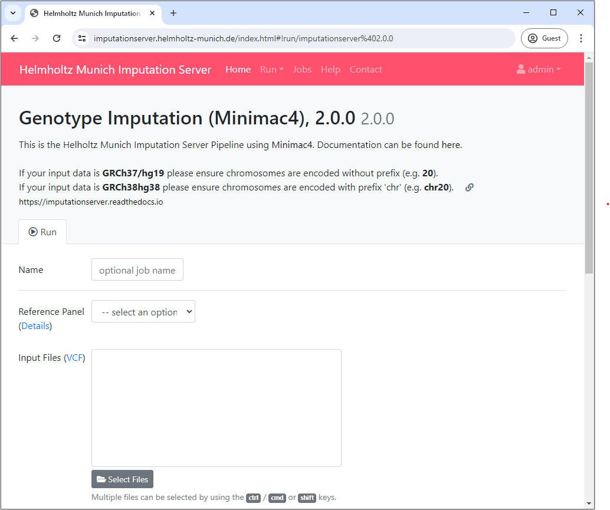
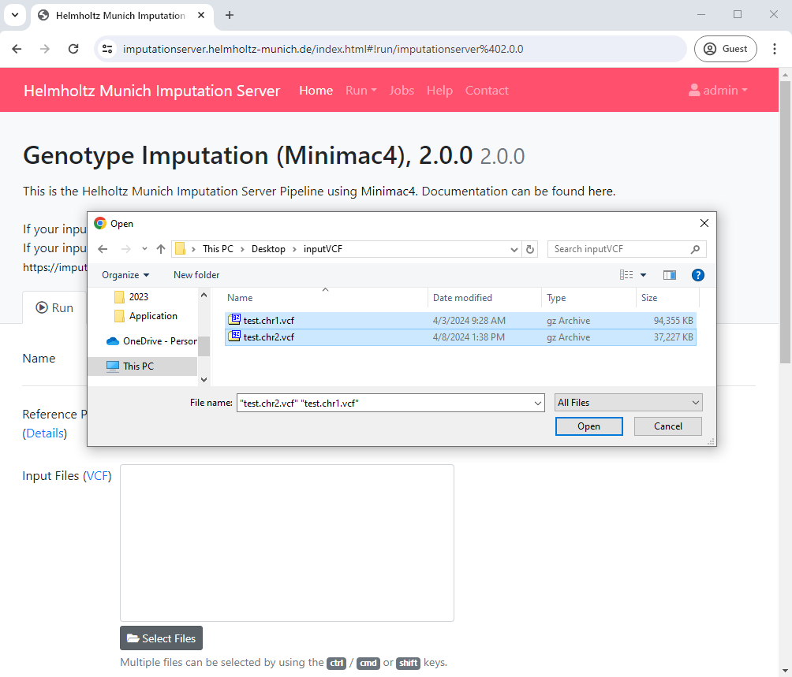
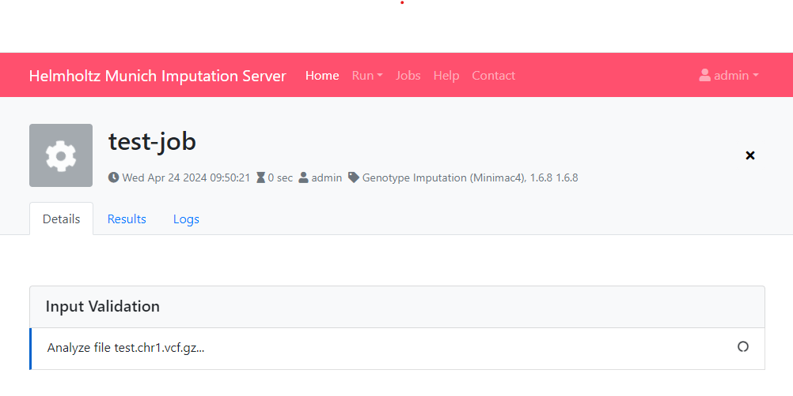
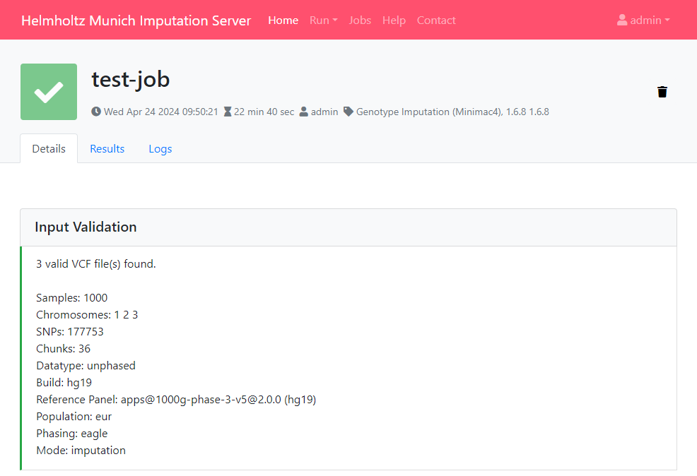
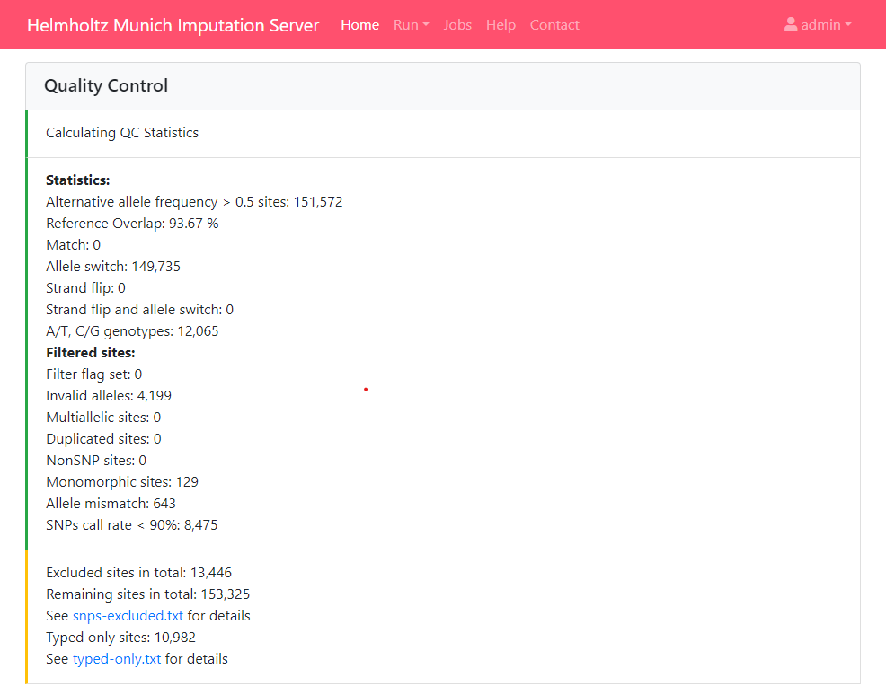
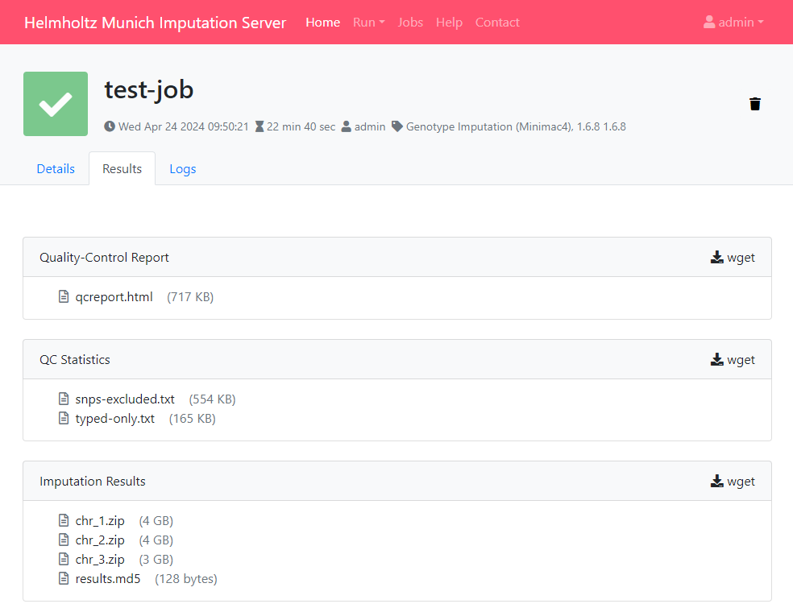
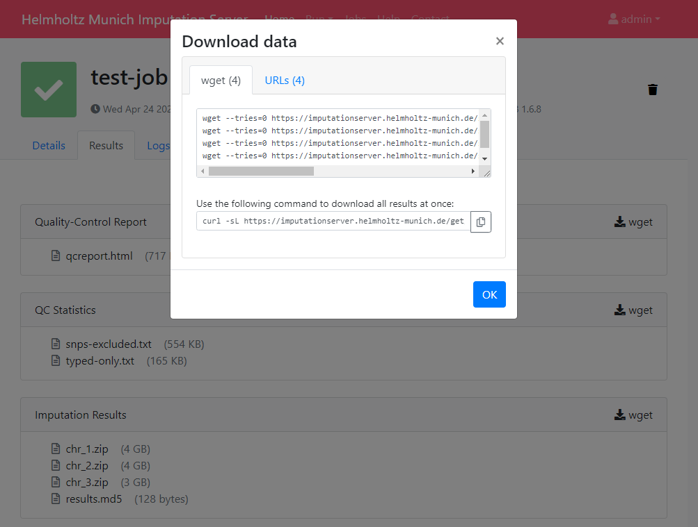
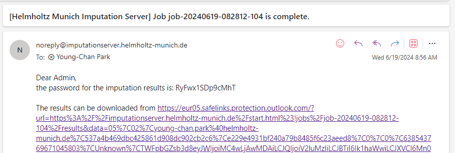
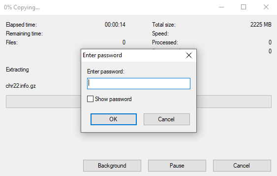

# Getting started

To use the Helmholtz Munich Imputation Server, a [registration](https://imputationserver.helmholtz-munich.de/index.html#!pages/register) is required.
We send an activation mail to the provided address. Please follow the instructions in the email to activate your account. If it doesn't arrive, ensure you have entered the correct email address and check your spam folder.

**After the email address has been verified, the service can be used without any costs.**

## Setup your first imputation job

Please [login](https://imputationserver.helmholtz-munich.de/index.html#!pages/login) with your credentials and click on the **Run** tab to start a new imputation job. The submission dialog allows you to specify the properties of your imputation job.



The following options are available:

### Reference Panel

Our server offers genotype imputation from different reference panels. Please select one that fulfills your needs and supports the population of your input data:

- HRC (Version r1.1 2016)
- 1000 Genomes Phase 3 (Version 5)
- HapMap 2

More details about all available reference panels can be found [here](https://imputationserver.readthedocs.io/en/latest/reference-panels/).

### Upload VCF files from your computer

When using the file upload, data are uploaded from your local file system to the Helmholtz Munich Imputation Server. By clicking on **Select Files** an open dialog appears where you can select your VCF files:



Multiple files can be selected using the `ctrl`, `cmd` or `shift` keys, depending on your operating system.
After you have confirmed your choice, all selected files are listed in the submission dialog:


Please make sure that all files fulfill the [requirements](./prepare-your-data.md).


!!! important
    Since version 1.7.2 URL-based uploads (sftp and http) are no longer supported. Please use direct file uploads instead. 

### Build
Please select the build of your data. Currently the options **hg19** and **hg38** are supported. the Helmholtz Munich Imputation Server automatically updates the genome positions (liftOver) of your data. All reference panels except TOPMed are based on hg19 coordinates.

### rsq Filter
To minimize the file size, the Helmholtz Munich Imputation Server includes a r<sup>2</sup> filter option, excluding all imputed SNPs with a r<sup>2</sup>-value (= imputation quality) smaller then the specified value.

### Phasing

If your uploaded data are *unphased*, Eagle v2.4 will be used for phasing. In case your uploaded VCF file already contains phased genotypes, please select the "No phasing" option.

|  Algorithm | Description |
| ---------- |-------------|
| **Eagle v2.4** | The [Eagle](https://data.broadinstitute.org/alkesgroup/Eagle/) algorithm estimates haplotype phase using the user selected reference panel. This method is also suitable for single sample imputation. After phasing or imputation you will receive phased genotypes in your VCF files. |

### Population

Please select the population of your uploaded samples. This information is used to compare the allele frequencies between your data and the reference panel. Please note that not every reference panel supports all sub-populations.

|  Population | Supported Reference Panels |
| ----------- | ---------------------------|
| **AFR** | 1000 Genomes Phase 3 (Version 5) |
| **AMR** | 1000 Genomes Phase 3 (Version 5) |
| **EAS** | 1000 Genomes Phase 3 (Version 5) |
| **SAS** | 1000 Genomes Phase 3 (Version 5) |
| **EUR** | all |
| **Mixed** | all |

In case your population is not listed or your samples are from different populations, please select **Mixed** to skip the allele frequency check. For mixed populations, no QC-Report will be created.

### Mode

Please select if you want to run **Quality Control & Imputation**, **Quality Control & Phasing Only** or **Quality Control Only**.


### AES 256 encryption

All Imputation Server results are encrypted by default. Please tick this checkbox if you want to use AES 256 encryption instead of the default encryption method. Please note that AES encryption does not work with standard unzip programs. We recommend to use 7z instead.


## Start your imputation job

After confirming our *Terms of Service*, the imputation process can be started immediately by clicking on **Start Imputation**. Input Validation and Quality Control are executed immediately to give you feedback about the data-format and its quality. If your data passed this steps, your job is added to our imputation queue and will be processed as soon as possible. 

We notify you by email as soon as the job is finished or your data don't pass the Quality Control steps.

### Input Validation

In a first step we check if your uploaded files are valid and we calculate some basic statistics such as amount of samples, chromosomes and SNPs.



After Input Validation has finished, basic statistics can be viewed directly in the web interface.



!!! info "Data Preparation"
    If you encounter problems with your data please read this tutorial about [Data Preparation](./prepare-your-data.md) to ensure your data are in the correct format. 

### Quality Control

In this step we check each variant and exclude it in case of:

1. contains invalid alleles
2. duplicates
3. indels
4. monomorphic sites
5. allele mismatch between reference panel and uploaded data
6. SNP call rate < 90%

All filtered variants are listed in a file called `statistics.txt` which can be downloaded by clicking on the provided link. More informations about our QC pipeline can be found [here](./pipeline.md).



If you selected a population, we compare the allele frequencies of the uploaded data with those from the reference panel. The result of this check is available in the QC report and can be downloaded by clicking on `qcreport.html`.

!!! info "On QC failure"
    If your data fails the QC step, please refer to the failed job's `qcreport.html` file, per-chromosome log files (e.g. `chr_1.log`), and the "Logs" tab to understand why your job failed. Please refer to the [Quality Control](./pipeline.md#quality-control) section in the [Pipeline Overview](./pipeline.md) page to learn about the QC steps. 

### Pre-phasing and Imputation

Imputation is achieved with Minimac4. The progress of all uploaded chromosomes is updated in real time and visualized with different colors.


### Data Compression and Encryption

If imputation was successful, we compress and encrypt your data and send you a random password via mail.


This password is not stored on our server at any time. Therefore, if you lost the password, there is no way to resend it to you.

## Download results

The user is notified by email, as soon as the imputation job has finished. A zip archive including the results can be downloaded directly from the server. To decrypt the results, a one-time password is generated by the server and included in the email. The QC report and filter statistics can be displayed and downloaded as well.



!!! important "All data are deleted automatically after 7 days"
    Be sure to download all needed data in this time period. We send you a reminder 48 hours before we delete your data. Once your job has the state **retired**, we are not able to recover your data!


###  Download via a web browser

All results can be downloaded directly via your browser by clicking on the filename.


### Download using `wget`

In order to download results via the commandline using `wget`or `aria2` you need to click on the **wget** symbol (located right to the folder header) to get the needed private links.



A new dialog appears which provides you all the private link. Click on the tab **wget command** to get a copy & paste ready command that can be used on Linux or MacOS to download the files individually in your terminal.

The command for downloading all results at once is also provided, which you can also copy & paste to your terminal to initiate the download. 


### Decrypting the results

An email containing the password to decrypt your results is sent to your email address upon the completion of the imputation job.



If AES 256 encryption was not selected during job submission, the results can be decrypted with standard unzip programs. A password prompt will appear when trying to unzip the results file, where the password provided in the email can be used to decrypt and uncompress the results.

**Unzipping in shell**  
```sh
$ unzip chr_22.zip 
Archive:  chr_22.zip
[chr_22.zip] chr22.info.gz password:
```

**Unzipping in Windows**  



If you selected AES 256 encryption, standard zip programs won't be able to decrypt the results, and you'll need to use a program like [7-Zip](https://www.7-zip.org/). Below is an example of using the command line version of 7-Zip.

```sh
$ 7z x chr_22.zip

7-Zip [64] 16.02 : Copyright (c) 1999-2016 Igor Pavlov : 2016-05-21
p7zip Version 16.02 (locale=C.UTF-8,Utf16=on,HugeFiles=on,64 bits,12 CPUs Intel(R) Xeon(R) E-2176M  CPU @ 2.70GHz (906EA),ASM,AES-NI)

Scanning the drive for archives:
1 file, 2333823025 bytes (2226 MiB)

Extracting archive: chr_22.zip
--
Path = chr_22.zip
Type = zip
Physical Size = 2333823025

    
Enter password (will not be echoed):
```